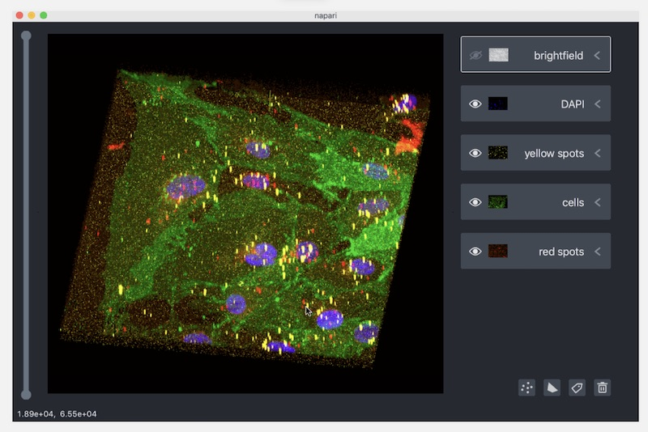

I'm working on a contract for [The Chan Zuckerberg
Initiative](https://chanzuckerberg.com/) to improve the rendering behavior
and performance of [Napari](https://napari.org/), a multi-dimensional image
viewer for Python.

Because the project is open source you can see some of the work here:

* [Performance Backgrounder and Philosophy](https://napari.org/docs/explanations/performance.html)
* [Render System Design](https://napari.org/docs/explanations/rendering.html)

Even specific code changes and discussions:

* [Pull Request #1343](https://github.com/napari/napari/pull/1343) - ImageSlice and ImageView
* [Pull Request #1262](https://github.com/napari/napari/pull/1262) - Performance Monitoring

After so many years working on proprietary projects open source is a
refreshing change. It's fun to develop "in the open" and to collaborate
with so many great developers across many different projects. When we ping
another project with a question or bug we often hear back within
hours, it's an exciting environment.
