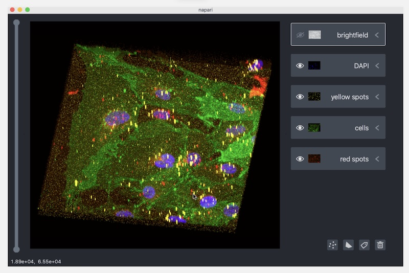

I'm working on an ongoing paid contract for [The Chan Zuckerberg
Initiative](https://chanzuckerberg.com/) to improve the rendering behavior
and performance of [Napari](https://napari.org/), an open source
multi-dimensional image viewer for Python, used for scientific imaging
mostly in the fields of Neuroscience and Biology.

Because the project is open source you can read two documents that I wrote
the first few weeks of the contract. I wanted to convey my thoughts on
performance and outline what I thought was needed in a new rendering
system.

Also below are two pull requests which contain my first changes towards
this new rendering system.

**Documents:**
* [Performance Backgrounder and Philosophy](https://napari.org/docs/explanations/performance.html)
* [Render System Design](https://napari.org/docs/explanations/rendering.html)

**Pull Requests:**
* [Performance Monitoring](https://github.com/napari/napari/pull/1453)
* [Asynchronous Image Loading](https://github.com/napari/napari/pull/1510)

After so many years working on proprietary projects open source is a
refreshing change. It's fun to develop "in the open" and to collaborate
with so many great developers across many different projects. When we ping
another project with a question or bug we often hear back within
hours, it's an exciting and productive environment.

I recorded this demo video to show results from the first three months of work on Napari:

<iframe width="560" height="315" src="https://www.youtube.com/embed/Jlm_jGRwH2Y" frameborder="0" allow="accelerometer; autoplay; encrypted-media; gyroscope; picture-in-picture" allowfullscreen></iframe>
