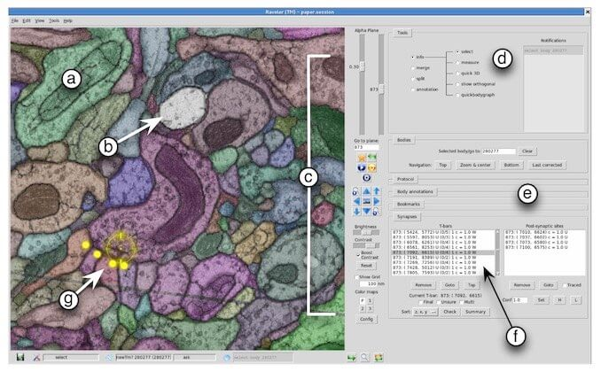

The [*Howard Hughes Medical Institute*](http://hhmi.org) funds research all over
the country, but [*Janelia Research Campus*](http://janelia.org) is their
facility in Ashburn, VA that's dedicated to  Neuroscience Research.

At Janelia I worked on a tool called **Raveler** that was used to inspect and
correct the automatically generated segmentation of electron microscope images.
The research goal was to create the connectome or "wiring diagram" of the fruit
fly brain.

When I joined Janelia, Raveler was limited in the image sizes you could browse.
I implemented a tiled viewer that in theory could browse images of any size,
using an approach similar to Google Maps. We were able to browse stacks with
thousands of images as large as 50,000 x 50,000 pixels. Over one terabyte of
total imagery. This work was done with OpenGL in Python.

I also added some 2D and 3D visualizations of the reconstructed neurons to give
users insight into shapes they were creating. The center image below is 2D while
the one on the right is 3D and can be rotated:

The users of Raveler worked in the building and it was gratifying to see
in-person how the improvements that we made to the software were making their
lives easier and their work more productive.
