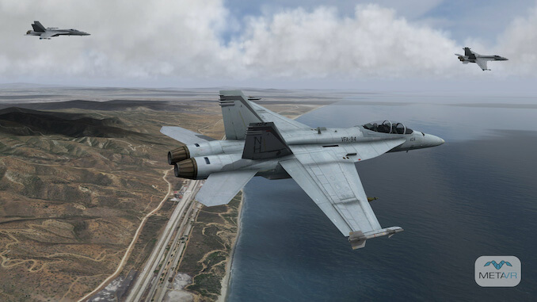
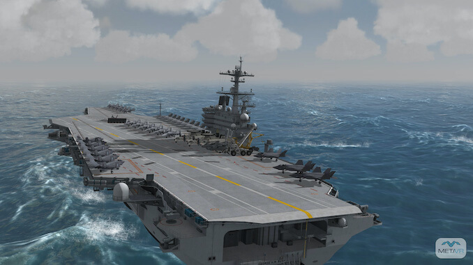
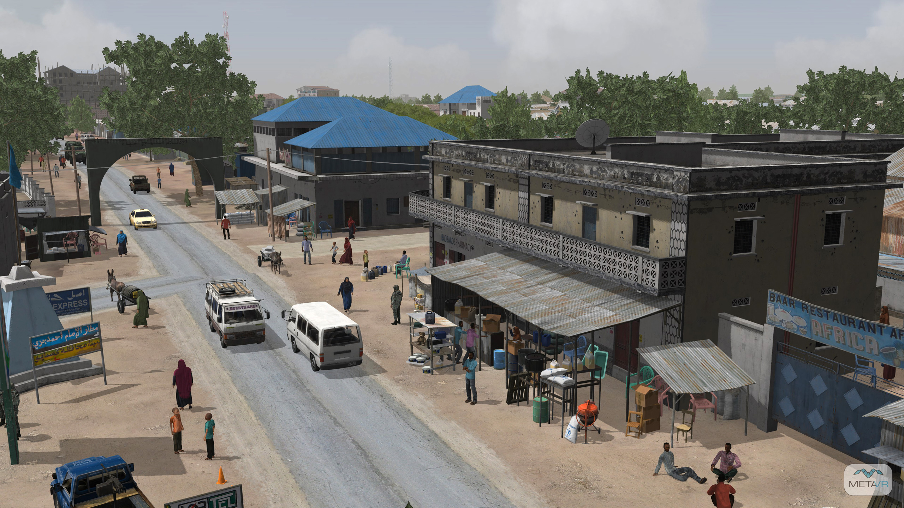

I spent eight years working on military simulations at
[*MetaVR*](http://metavr.com) mostly on their **Virtual Reality Scene
Generator** (VRSG) product. VRSG advertises "game quality graphics" but unlike
most games it has a round-Earth terrain format that enables simulations that
span hundreds of kilometers.

VRSG is used in many production military simulators including well known aircraft
such as the F-16, A-10 and F-22 as well as on some sea and ground-based
simulators.

My first project at MetaVR was to add a human animation system. Over time I
worked on many aspects from graphics to networking to architecture. I developed
a web-based performance monitoring and QA tool that required removing randomness
from the system so we could generate videos that were pixel-identical even when
taken weeks apart. I used the structural similarity (SSIM) index to find minute
differences between other identical videos.

Working on military simulations required mixing in video game technology with
hard technical requirements and interoperability issues that you don't typically
encounter with normal games. The codebase at MetaVR was primarily C++ using
DirectX for the graphics, and my performance tools were written in Python.

<a href="/about/videogames"><button type="button" class="btn btn-primary">
Next <i class="fas fa-arrow-alt-circle-right ml-2"></i>
</button></a>
