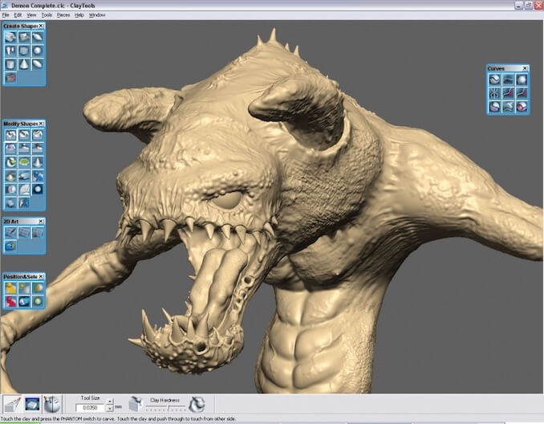
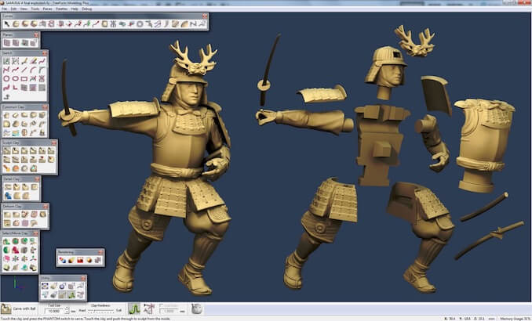
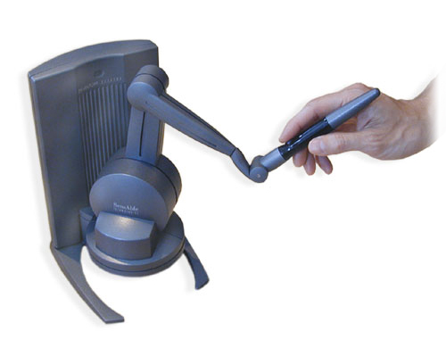

### FreeForm

I worked on **FreeForm** during four years at SensAble Technologies. FreeForm is
a software and hardware system that gives you the experience of carving "virtual
clay". FreeForm is still available today, it's now sold by [*3D
Systems*](https://www.3dsystems.com/software/geomagic-freeform), 

I worked on many aspects of FreeFrom from the UI to graphics and haptics and I
was a member of the four person architecture board. FreeForm was a complex piece
of software with close to a million lines of C++ code. We learned many lessons
about design, architecture, code quality, performance and testing.

### Haptics

FreeForm is not just a software package, it comes with a haptic device called
the **Phantom**. The device simulates real physical interaction, you can feel
the model as you are carving it. It's quite a striking effect, people tend to be
amazed when they first try it.

When programming graphics 60Hz is usually the goal, which means you have 16.7
milliseconds to generate the next frame. With the Phantom the device had to run
at 1000Hz. This meant you only had 1 millisecond to do the force computation. It
required a large number of performance tricks and optimizations to run that
fast.

