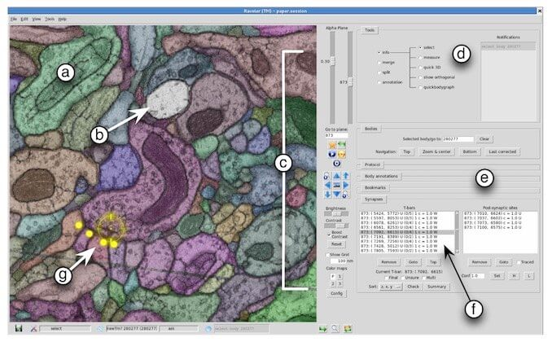
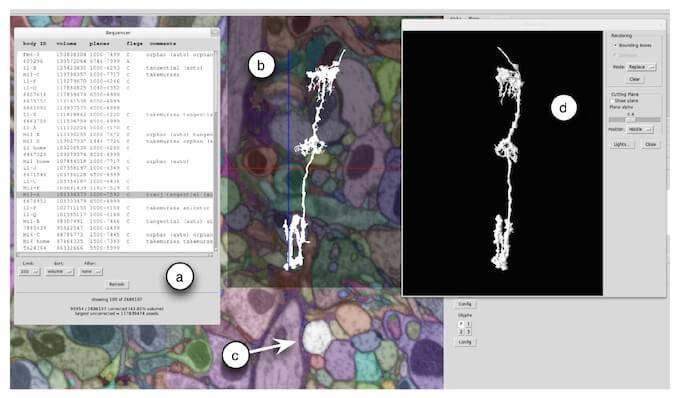

The [*Howard Hughes Medical Institute*](http://hhmi.org) funds research all over
the country but they have a decided facility called the [*Janelia Research
Campus*](http://janelia.org) that focuses exclusively on Neuroscience.

At Janelia I worked on a tool called **Raveler** that was used to inspect and
correct the segmentation of electron microscope images. The goal was to produce
a connectome or "wiring diagram" of the fruit fly brain.

When I joined Janelia Raveler was limited to browsing images up to a certain
size. I implemented a tiled viewer that in theory could browse images of any
size, using an approach similar to how Google Maps works. We were able to browse
stacks with thousands of images all larger than 40,000 x 40,000 pixels, over a 1TB
of total imagery. This work was with OpenGL in Python.

I also added some 2D and 3D visualizations of the reconstructed neurons as seen
below. These gave the users another ways to monitor their progress and they
fixed the segmentation.

At Janelia the users were "in house", it was gratifying to see in person how the
improvements you were making to the software were making their lives easier and
more productive.