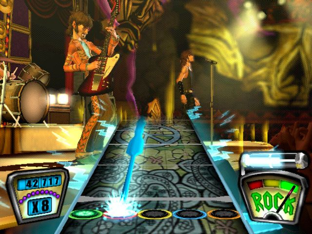
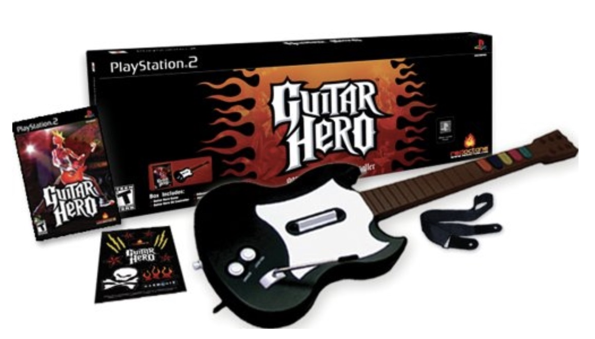
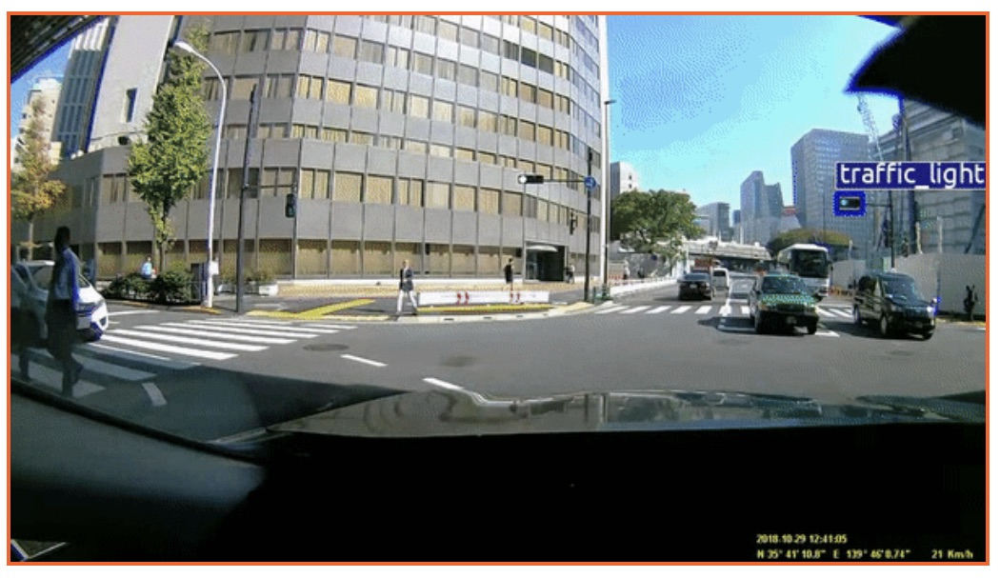

# FreeForm

I worked on FreeForm for four years as a Senior Software Engineer at SensAble
Technologies. FreeForm is a computer aided design (CAD) software package that
came with a pen-like haptic device. The user could physically feel the model
they were carving. Today FreeForm is sold by [3D Systems](https://www.3dsystems.com/software/geomagic-freeform).

# Guitar Hero

I was the Lead Programmer at [Harmonix](https://www.harmonixmusic.com/) on the
original Guitar Hero release for the PlayStation 2 in 2005. I worked on the game
graphics and other systems. The franchise went on to over $1B in sales by 2008.

# Cloud Data Pipelines

I worked on three generations of cloud-based data processing pipeline at
[Carmera](https://carmera.com) over a period of three years. The scalable
pipelines to processed geospatial data and performed trained Machine Learning
systems.

# VRSG

I worked on the [Virtual Reality Scene
Generator](https://www.metavr.com/products/vrsg-overview.html) for eight years
at [MetaVR](https://metavr.com). VRSG is use as the graphics component of many
military simulators such as for the F-16, A-10 and F-22 aircraft. I contributed
to many portions of the system from graphics to architecture to tools.

# Raveler

I worked on Raveler at [HHMI](https://www.hhmi.org/) ([Janelia Research
Campus](https://www.janelia.org/)) as a Senior Software Engineer. Raveler was
software used to inspect and correct the "segmentation" of electron microscope
images in order to construct the "connectome" of the fruit fly brain.

