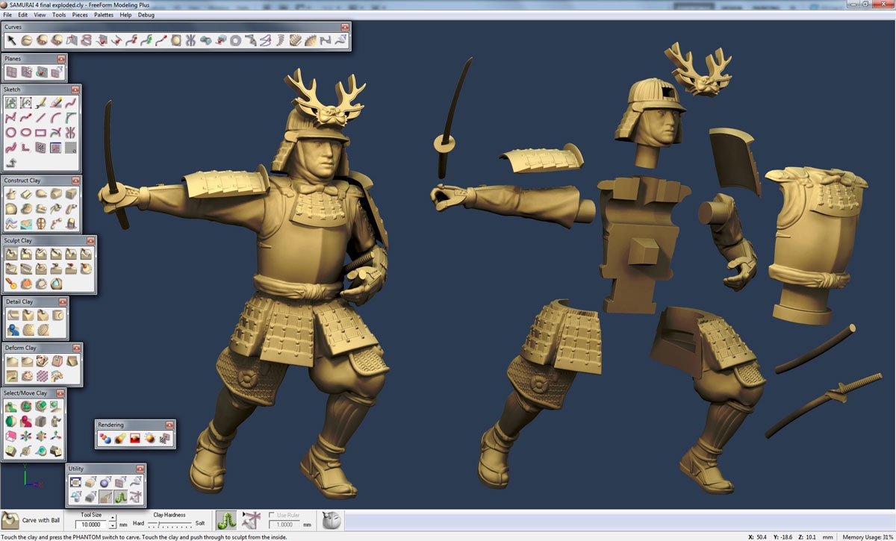
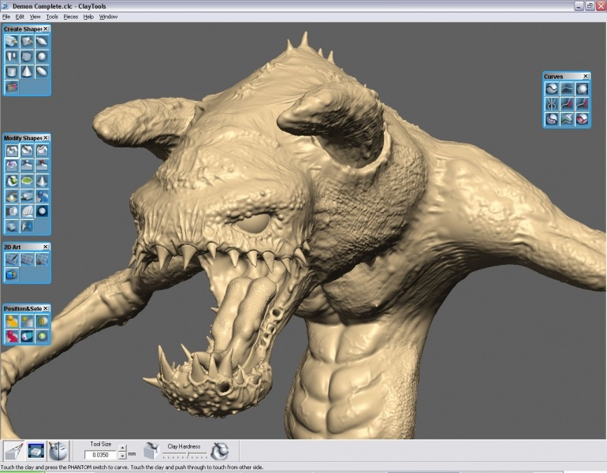
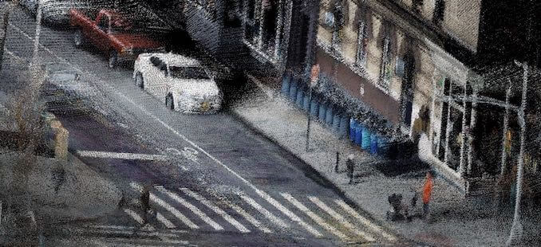
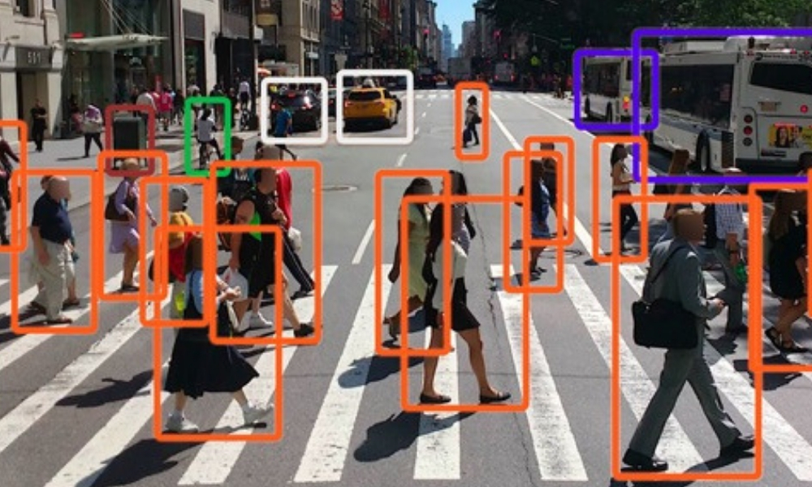
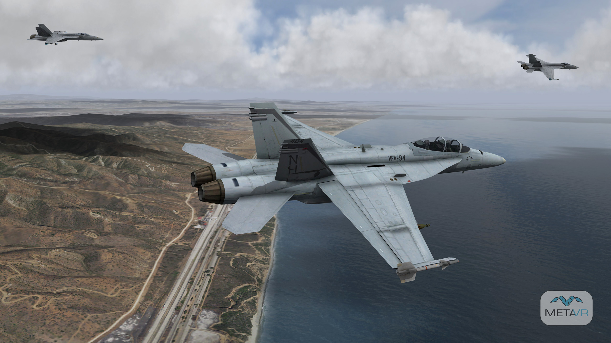
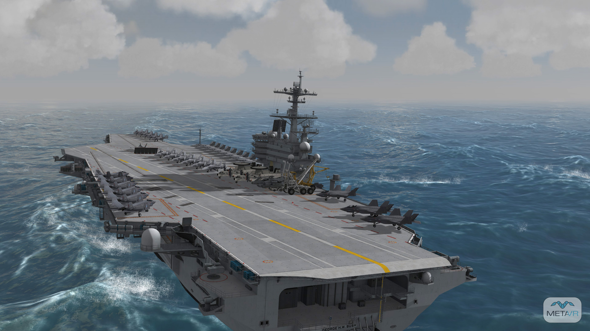
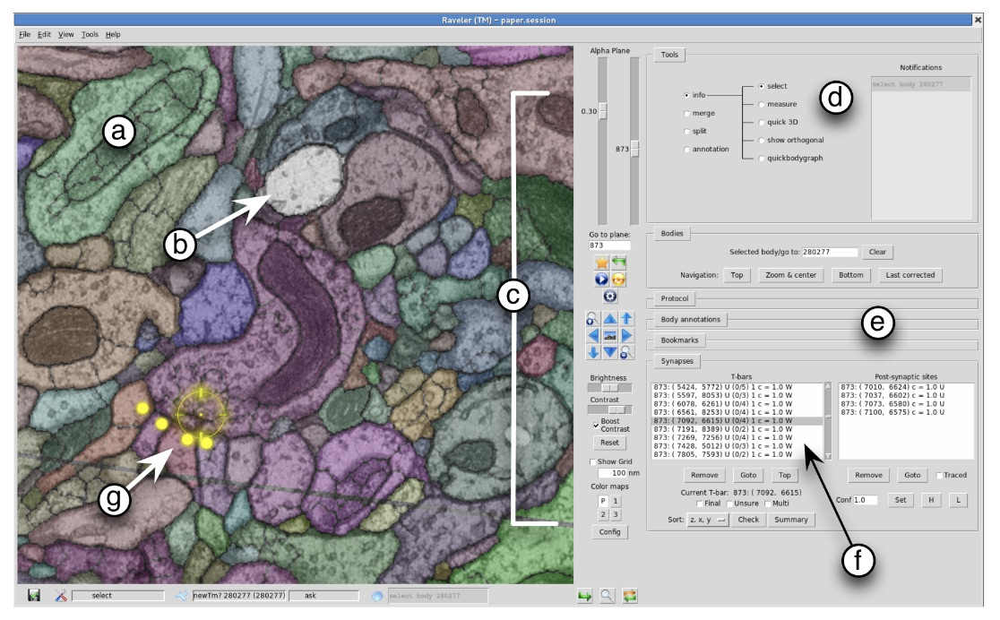
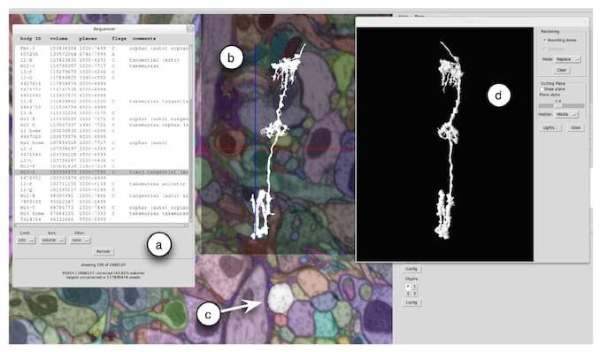

## FreeForm
Company: *SensAble Technologies* &rarr; [*3D
Systems*](https://www.3dsystems.com/software/geomagic-freeform)

**FreeForm** is a computer aided design (CAD) software package that is operated
with a haptic (force feedback) device. I worked on many aspects of FreeFrom from
graphics to haptics to architecture during a four year period.

## Guitar Hero
Company: [*Harmonix Music Systems*](http://harmonixmusic.com)

**Guitar Hero** was a game for the PlayStation 2 released in 2005. The franchise
went on to over $1B in sales by 2008. I wrote game logic, 2D and 3D graphics and
coordinated with the leads in Design, Art, Audio and QA. 

## Cloud Data Pipelines
Company: [*CARMERA*](http://carmera.com)

The scalable pipelines processed geospatial data and performed Machine Learning
training. The pipelines used many AWS Services such as Step Functions, Lambda,
SNS, SQS, Batch. I worked on several generations of cloud-based data processing
pipelines over a period of three years. 

## VRSG
Company: [*MetaVR*](http://metavr.com)

**Virtual Reality Scene Generator** (VRSG) provides the graphics for many
production military simulators, for example the simulators for the F-16, A-10
and F-22 aircraft use VRSG. I contributed to many portions of the system from
graphics to architecture to performance tools during eight years with MetaVR.

## Raveler
Company: [*Howard Hughes Medical Institute*](http://hhmi.org) - [*Janelia Research Campus*](http://janelia.org).

**Raveler** was used to inspect and correct the segmentation of electron
microscope images in order to construct the connectome of the fruit fly brain.
I added the ability to browse huge image stacks with a tiled viewer and created
several 2D and 3D visualizations of the resulting neurons.

