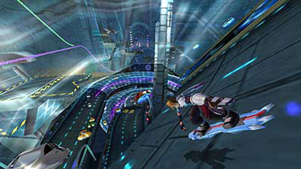
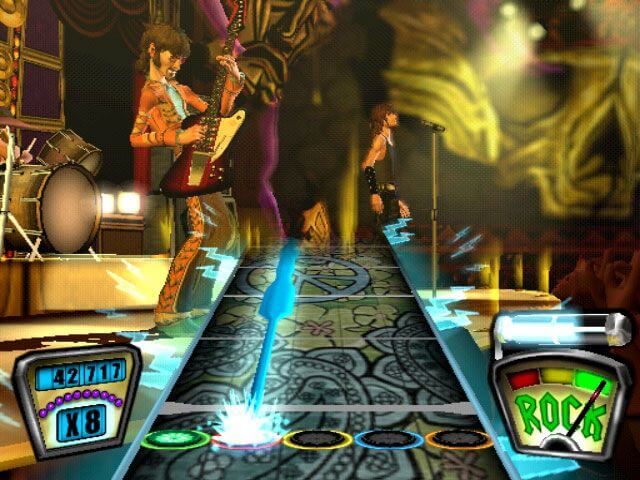
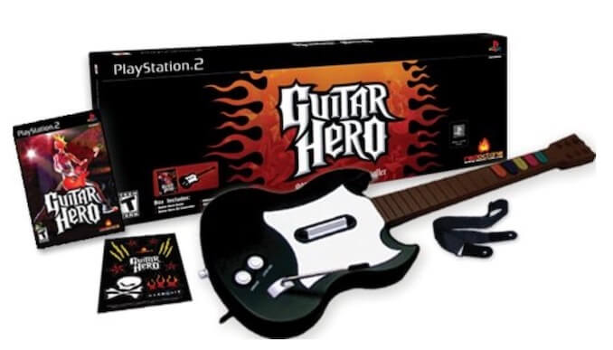

I joined [Harmonix](https://www.harmonixmusic.com/) in 2003 to work on [EyeToy:
Antigrav](https://en.wikipedia.org/wiki/EyeToy:_AntiGrav) for the PlayStation 2.
The [EyeToy](https://en.wikipedia.org/wiki/EyeToy) was a camera that you put on
your TV so your body could be the controller. In our game you moved your arms
and body around to pilot a hoverboard through futuristic scenes. It was a fun
game and gave you a good workout:

Harmonix's next game was [Guitar
Hero](https://en.wikipedia.org/wiki/Guitar_Hero). This time I was chosen to be
the Lead Programmer which means in addition to programming I coordinated closely
with the Project Leader and the leads from each of the other disciplines: Music,
Art, Design and QA. I often had to estimate how long it take to program a new
feature, or suggest an alternative that was easier for us to implement.

I was also responsible making sure the game was playable every single day, if
the daily build failed or any reason I had to track it down.

After almost a decade of making music-based videogames that were critically well
received but had modest sales, Guitar Hero was a breakout mega-hit. We knew it
was a solid and fun game, but we had no idea the economic and cultural impact it
would have. The Guitar Hero franchise went on to over two billion dollars in
sales.

I learned a lot of great software engineering habits while at Harmonix.  The
rigors of console game development are legendary, since you have limited
hardware but the games need to be polished and perform flawlessly. Working with
the musicians and artists on the team was a blast, and I learned a fair amount
about game design, and design in general.

