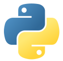

**Official Sites**

* [Homepage](https://python.org)

**Static Typing**

* [Our journey to type checking 4 million lines of Python](https://dropbox.tech/application/our-journey-to-type-checking-4-million-lines-of-python)
  * Dropbox uses type hinting and [`mypy`](http://mypy-lang.org/) on their huge codebase.

**Utilities**

* [Cookiecutter](https://github.com/cookiecutter/cookiecutter)
  * Create projects from templates.

**Article**

* [Pickles Nine Flaws](https://nedbatchelder.com/blog/202006/pickles_nine_flaws.html)

**Static Analysis**

* [Wily](https://wily.readthedocs.io/en/latest/)
    * Command-line tool for exploring the complexity of Python code over time.
  