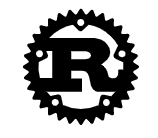

**Official Pages**
* [Homepage](https://www.rust-lang.org/)
* [WebAssembly](https://www.rust-lang.org/what/wasm)

**Introductions**
* [What is Rust and why is it so popular?](https://stackoverflow.blog/2020/01/20/what-is-rust-and-why-is-it-so-popular/)

**Weld**
* [Interview with Weld’s main contributor](https://notamonadtutorial.com/weld-accelerating-numpy-scikit-and-pandas-as-much-as-100x-with-rust-and-llvm-12ec1c630a1)
  * Bare-metal performance for high-level APIs such as NumPy and Pandas.
* [Shoumik Palkar](https://shoumik.xyz/)
  * Creator of Weld, PhD at Stanford, now at [Databricks](https://databricks.com/).

**WASM**
* [Hands-on WebAssembly](https://evilmartians.com/chronicles/hands-on-webassembly-try-the-basics)
    * Mostly WASM but some Rust.
* [WebAssembly Migration](https://softwareengineeringdaily.com/2020/09/01/webassembly-migration-with-nicolo-davis/)
    * Podcast on Rust to WebAssembly workflow.

**Interesting Projects**
* [Bevy](https://bevyengine.org/news/introducing-bevy/) a data-driven game engine.
* [Single Page Applications](http://www.sheshbabu.com/posts/rust-wasm-yew-single-page-application/) using Rust+WASM for web development.
