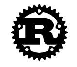

**Official Pages**
* [Homepage](https://www.rust-lang.org/)
* [WebAssembly](https://www.rust-lang.org/what/wasm)

**Weld**
* [Interview with Weld’s main contributor](https://notamonadtutorial.com/weld-accelerating-numpy-scikit-and-pandas-as-much-as-100x-with-rust-and-llvm-12ec1c630a1)
  * Bare-metal performance for high-level APIs such as NumPy and Pandas.
* [Shoumik Palkar](https://shoumik.xyz/)
  * Creator of Weld, PhD at Stanford, now at [Databricks](https://databricks.com/).